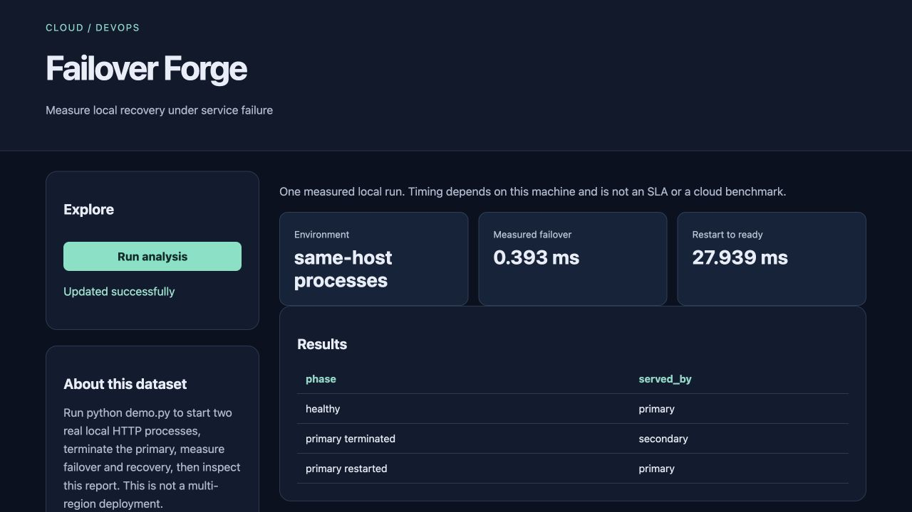

# Failover Forge

Measure local recovery under service failure for **reliability learners**.

Cloud/DevOps topic selected with explicit user authorization after source verification; it is not attributed to an unseen Instagram slide.

> Local portfolio implementation developed with Codex assistance. Measured results and limitations are documented; no production adoption, revenue or hiring outcome is claimed.



## What works

- Two real local HTTP processes
- Client-side fallback after primary termination
- Measured restart-to-ready evidence and cleanup

[Example output](reports/example-output.json) · [Recorded checks](reports/test-results.txt) · [Learning and interview guide](LEARNING_GUIDE.md)

## Start

Python 3.12 is the validated Python runtime. Run commands from this repository directory. Windows users activate `.venv\Scripts\activate` instead of `source`.

```sh
python3.12 -m venv .venv
source .venv/bin/activate
python -m pip install -r requirements.txt
python demo.py
python app.py
```

Open **http://127.0.0.1:8080**. Keep the process running. Set `PORT` to use another port. The Python development servers are intended for local demonstrations.

## Demonstration

Run python demo.py. It serves from the primary, terminates it, serves from the secondary, restarts the primary, records timings, and cleans up. Start app.py to inspect the resulting report.

## Architecture and decisions

Browser controls → validated Flask API → project analysis/workflow → results and export.

Stack: Python · HTTP · SQLite.

1. Start two real local HTTP processes and wait for readiness before injecting failure.
2. Terminate only the owned primary process and route the next client request to the secondary.
3. Measure failover and restart-to-ready durations with a monotonic clock and always clean up child processes.

## Verification

```sh
python -m pytest -q
```

See [VERIFICATION.md](VERIFICATION.md) for actual executed checks, setup verification, model/data results and any outstanding environment limitations. The [recorded CI runs](reports/ci-verification.json) passed for the linked source revision.

## Data and attribution

Local synthetic service traffic. See [DATA_AND_SOURCES.md](DATA_AND_SOURCES.md) for provenance and usage notes. Original project code is MIT unless a preserved source file or dependency states otherwise. Model and third-party data licenses remain separate.

## Limitations and next improvement

Single-host, stateless client-side fallback. No load-balancer process, replicated database, cloud availability-zone failure or data-loss measurement. One local run cannot establish an SLA; RPO is not applicable.

Suggested extension: Add a both-nodes-down case and assert the client reports total unavailability.

## Honest portfolio use

This implementation and documentation were developed with substantial Codex assistance. Before presenting it, run the demonstration, explain the design choices, and complete the suggested independent modification. Do not describe generated code as work experience, an accepted upstream contribution, or a deployed production service.
